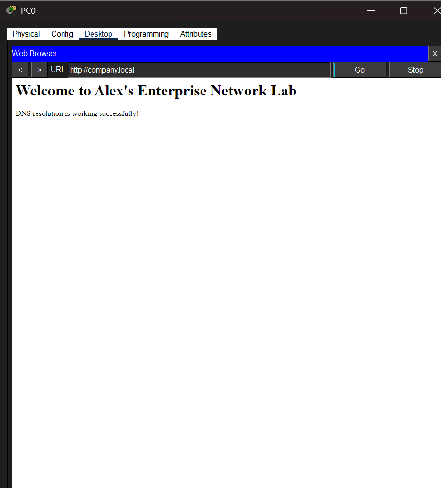

# DNS & Web Server Lab


---

## Overview

Every time you type a website address into a browser, DNS silently translates that name into an IP address before your request goes anywhere. Without DNS, the internet as we know it wouldn't function — and for network security professionals, DNS is one of the most critical protocols to understand because it is also one of the most abused.

This lab configures a complete DNS and web server infrastructure from scratch in Cisco Packet Tracer — demonstrating how DNS resolution works end-to-end, from A record creation to browser-based domain access. The lab also explores DNS from a security perspective: why DNS is a prime attack target and what defenders look for.

---

## Network Topology


```
         Router0 (192.168.10.1)
              |
           Switch0
        /    |    \
       /     |     \
DNS Server  Web    PC0
.10.2      Server  .10.10
           .10.3
```

| Device | Role | IP Address | Subnet Mask | Gateway |
|--------|------|------------|-------------|---------|
| Router0 | Default Gateway | 192.168.10.1 | 255.255.255.0 | N/A |
| DNS Server | Name Resolution | 192.168.10.2 | 255.255.255.0 | 192.168.10.1 |
| Web Server | HTTP Hosting | 192.168.10.3 | 255.255.255.0 | 192.168.10.1 |
| PC0 | Client | 192.168.10.10 | 255.255.255.0 | 192.168.10.1 |

---

## Configuration

### Router Configuration

```bash
enable
configure terminal
interface GigabitEthernet0/0
 ip address 192.168.10.1 255.255.255.0
 no shutdown
end
write memory
```

### DNS Server Configuration

In Packet Tracer, DNS is configured via the Services tab on the server:

| Setting | Value |
|---------|-------|
| DNS Service | ON |
| Record Type | A Record |
| Domain Name | company.local |
| IP Address | 192.168.10.3 |

### PC0 — DNS Client Configuration

| Setting | Value |
|---------|-------|
| IP Address | 192.168.10.10 |
| Default Gateway | 192.168.10.1 |
| DNS Server | 192.168.10.2 |

### Web Server — HTML Page

```html
<html>
<body>
  <h1>Welcome to Alex's Enterprise Network Lab</h1>
  <p>DNS resolution is working successfully!</p>
  <p>You reached this page by typing company.local — your request was resolved by the DNS server at 192.168.10.2</p>
</body>
</html>
```

---

## How DNS Resolution Works in This Lab

When PC0 types `http://company.local` into the browser:

```
1. PC0 sends a DNS query to 192.168.10.2 (DNS Server)
   Query: "What is the IP address of company.local?"

2. DNS Server looks up its A record:
   company.local → 192.168.10.3

3. DNS Server returns the IP to PC0

4. PC0 sends HTTP GET request to 192.168.10.3 (Web Server)

5. Web Server responds with the HTML page

6. Browser renders the page
```

---

## Verification

```bash
! On PC0 — test connectivity before DNS test
ping 192.168.10.1        ! Ping gateway
ping 192.168.10.2        ! Ping DNS server
ping 192.168.10.3        ! Ping web server

! Browser test
http://company.local     ! DNS resolution + HTTP access test

! On Router
show ip interface brief  ! Verify interface status
show running-config      ! Review configuration
```




---

## Troubleshooting

### Issue 1 — Duplicate IP Addresses
**Symptom:** Intermittent connectivity — sometimes devices could ping each other, sometimes not.  
**Diagnosis:** `arp -a` on PC0 showed two different MAC addresses mapping to the same IP at different times — classic IP conflict behaviour.  
**Root Cause:** Two devices had been assigned the same IP address (192.168.10.2).  
**Resolution:** Assigned unique IPs to all devices. Verified with `ping` — stable connectivity restored.  
**Lesson:** IP conflicts cause intermittent failures that are hard to diagnose without checking ARP tables.

### Issue 2 — Packet Tracer Cache Problem
**Symptom:** After reconfiguring a device's IP, Packet Tracer showed "IP address already in use" even though no conflict existed.  
**Root Cause:** Packet Tracer's internal cache retained the old IP assignment even after the config was changed.  
**Resolution:** Deleted and recreated the affected device, then reassigned IPs. Issue resolved.

### Issue 3 — PC0 Cannot Reach Any Device
**Symptom:** PC0 failed to ping gateway, DNS server, or web server.  
**Diagnosis:** Verified IP configuration on PC0 — all settings looked correct. Deleted and recreated PC0 and DNS server to reset Packet Tracer state.  
**Resolution:** After recreating and reassigning, full connectivity was established.

---

## Security Relevance

DNS is one of the most targeted protocols in network attacks. Understanding how it works is essential for defenders:

**DNS as an Attack Vector:**
- **DNS Spoofing / Cache Poisoning** — an attacker injects malicious A records into a DNS cache, redirecting users to fake servers. Example: `company.local` resolves to the attacker's IP instead of the legitimate web server
- **DNS Tunnelling** — attackers encode data inside DNS queries to exfiltrate data or establish C2 communication through firewalls that don't inspect DNS traffic (MITRE ATT&CK T1071.004)
- **DNS Hijacking** — modifying DNS settings on a router or client to redirect all traffic through an attacker-controlled resolver
- **Subdomain Takeover** — unclaimed DNS records pointing to decommissioned cloud resources can be hijacked

**SOC Relevance:**
- DNS logs are one of the first places SOC analysts look during an investigation — unusual domains, high query volumes, or queries to known malicious IPs are key IOCs
- DNS over HTTPS (DoH) and DNS over TLS (DoT) are modern encrypted DNS protocols that increase privacy but complicate SOC visibility

**Framework Mapping:**
- NIST SP 800-53 **SC-20** (Secure Name / Address Resolution Service)
- NIST SP 800-53 **SC-22** (Architecture and Provisioning for Name/Address Resolution)
- MITRE ATT&CK **T1071.004** (DNS — Application Layer Protocol for C2)

---

## Skills Demonstrated

| Skill | Details |
|-------|---------|
| DNS Configuration | Configured A records and DNS service for domain resolution |
| Web Server Deployment | Hosted HTML content accessible via domain name |
| DNS Resolution Verification | Verified end-to-end name resolution via browser test |
| IP Conflict Diagnosis | Identified and resolved duplicate IP address issues |
| DNS Security Concepts | Cache poisoning, DNS tunnelling, hijacking, NIST SC-20 |
| MITRE ATT&CK Mapping | T1071.004 (DNS C2) awareness |
| Cisco IOS CLI | Router configuration and verification |

---

## Author

**Alex Ojo** — Cybersecurity Student | Network Security Enthusiast  
🔗 [GitHub](https://github.com/alexojocyber) | [LinkedIn](https://www.linkedin.com/in/alex-ojo-ab9252185) | [Portfolio](https://alexojocyber.github.io)
